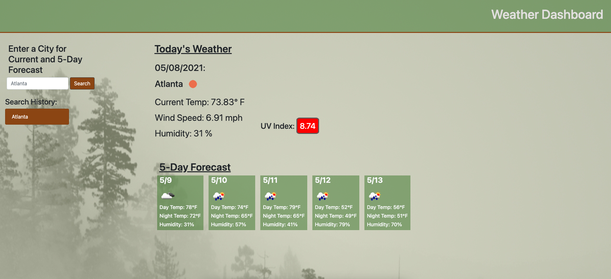

# weather_dashboard

## Project Goal

Develop a weather dashboard that allows user to find current weather and a five-day forecast for the city of their choice.

## Project Scope

1. When the user searches for a city they are presented with current and future conditions for that city and that city is added to the search history.
2. The current weather conditions for the chosen city should present the city name, the date, an icon representation of weather conditions, the temperature, the humidity, the wind speed, and the UV index.
3. The UV index should be presented with a color that indicates whether the conditions are favorable, moderate, or severe.
4. The 5-Day forecast should present the date, an icon representation of weather conditions, the temperature, the wind speed, and the humidity.
5. When a user clicks on a city in the search history they are again presented with current and future conditions for that city.

## Deployed Screen-Shot

## Application Link
https://brunett82.github.io/weather_dashboard/

## Project Owner

Rob Brunett

## Project Completion Date

5/8/2021